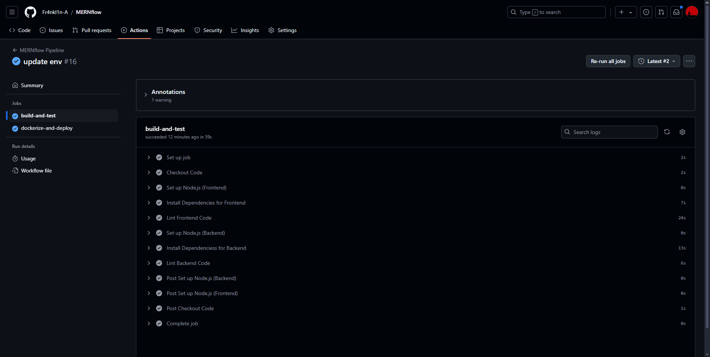

# MERNflow: CI/CD with GitHub Actions

## Overview:
This project demonstrates the CI/CD pipeline setup for a MERN (MongoDB, Express, React, Node.js) stack application using Docker, GitHub Actions, and AWS EC2. The pipeline automates the build, test, and deployment processes, and sends email notifications on success or failure.

## Diagram:


## Features:
- CI/CD Pipeline: Fully automated pipeline to build and deploy a MERN application.
- Dockerized Environment: Both frontend and backend are containerized using Docker for portability and consistency.
- Security Scanning: Uses Trivy to scan Docker images for vulnerabilities.
- Automated Deployment: Automatically deploys the application to AWS EC2 on push to the main branch.
- Email Notifications: Sends email notifications for successful or failed deployments.

## Deployment Guide:

### Prerequisites:
- GitHub Repository: Your code should be pushed to a GitHub repository.
- Docker: To build and run the containers.
- AWS EC2 Instance: To deploy the application.
- Runner: Add your EC2 Instance as a runner in Github Actions.
- MongoDB Atlas: An active MongoDB Atlas account and a MongoDB database instance.
- GitHub Repository Secrets: You will need to set up secrets in your GitHub repository for email configuration and AWS credentials:
  - DOCKER_USERNAME
  - DOCKER_PASSWORD
  - EMAIL_USERNAME (the one you want to use for sending the notification)
  - EMAIL_PASSWORD
  - REC_EMAIL (receiver's email)

### Steps to Deploy:
1. **Clone the Repository:** First, clone this repository to your local machine:  
```bash
git clone https://github.com/Fr4nkl1n-A/MERNflow  
cd MERNflow
```
2. **Create Your Own Repository on GitHub:**
   - Go to GitHub and create a new repository.
   - Once created, add your new repository as a remote to your local clone:  
     ```bash
     git remote set-url origin https://github.com/<your-github-username>/<your-new-repository-name>.git
     ```
3. **Set Up Your Environment Variables:** Configure the following environment variables based on your setup.
4. **Push the Code to Your GitHub Repository:** After setting up the *.env* file, commit your changes and push the code to your GitHub repository:  
    ```bash
    git add .  
    git commit -m "Setup for deployment"
    git push origin main
    ```
5. **Set Up GitHub Actions:** When you push your code, the GitHub Actions workflow will automatically trigger the deployment process. This includes:  
    - Building the Docker images
    - Running security scans with Trivy
    - Pushing the images to a container registry
    - Deploying to AWS EC2
6. **Get Notified:** Once the pipeline completes, you will receive an email notification about the deployment status (success or failure).

### Accessing the Application:
- After deployment, you can access the frontend of the application through the EC2 public IP or domain (if configured).
- Admin access is available after logging in.

## Screenshots
### CI/CD Pipeline: Fully automated pipeline to build and deploy a MERN application.



### Email Notifications: Sends email notifications for successful or failed deployments.


### Dockerized Environment: Both frontend and backend are containerized using Docker for portability and consistency.


### Web Preview


 

